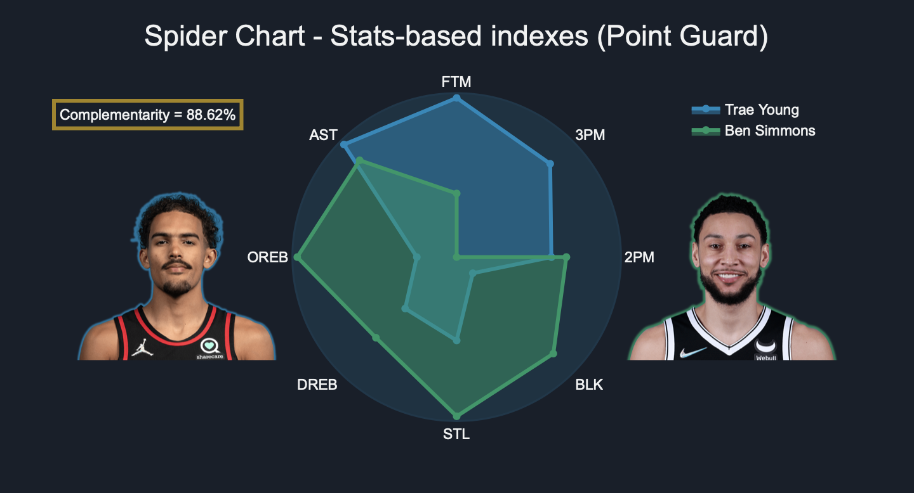
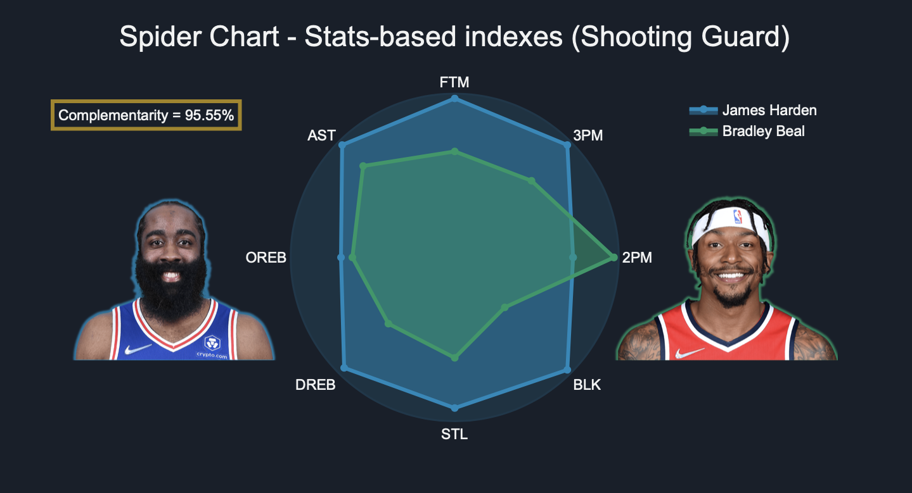
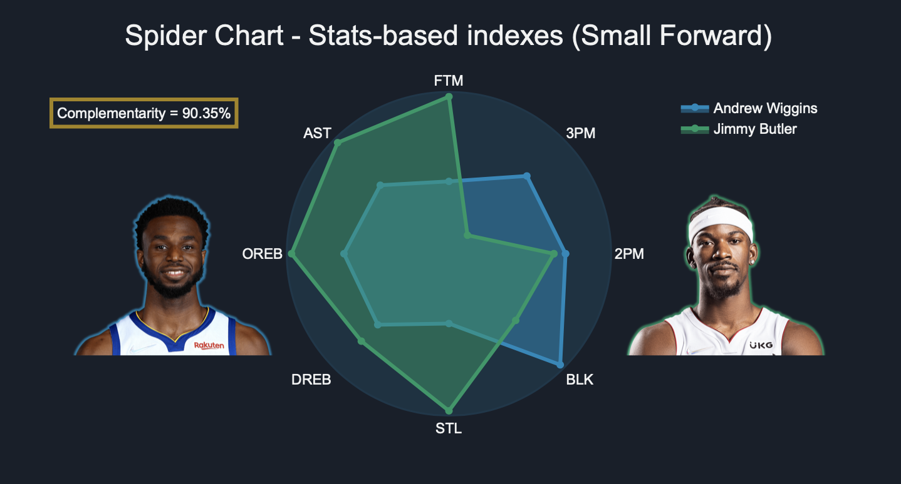
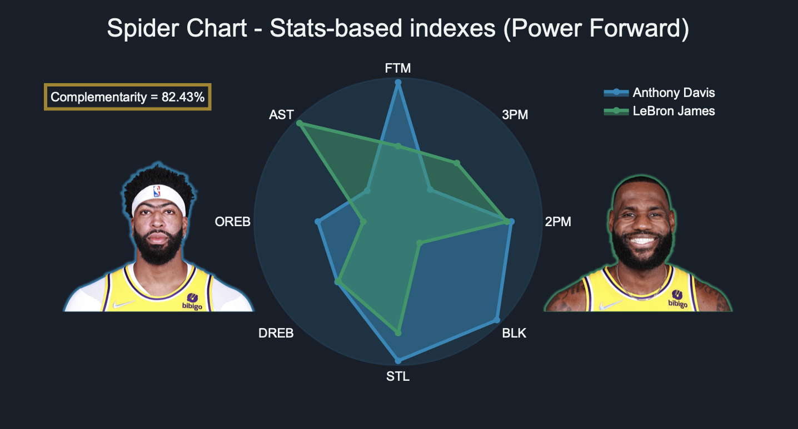
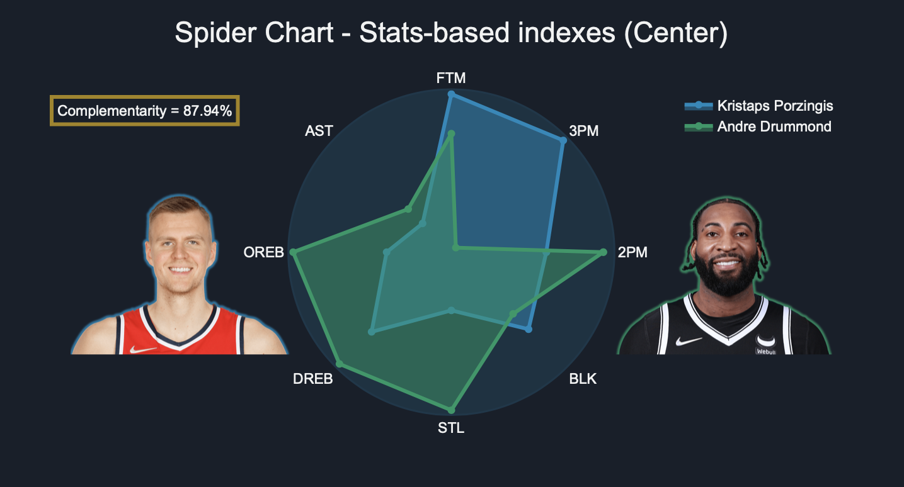

# NBA Complementarity

Find the role-specific complementarity, i.e. find two different players with the same role that maximise the overall
outout the most. Where overall outout is defined as the combination of all the main stats per game.

- In data there are the csv/excel and png files necessary for the main codes:

  - Compatibility_Exercise_1.1.xlsx, the key stats of 261 NBA players in the season 2019/2020
  - NBA STATsR.csv, dataset of players performances through the decade 2010-2020
  - PG.png, SG.png, SF.png, PF.png, C.png, supporting images for plots

- In images there are the png files for the README.md plots
 
- NBA Complementarity.ipynb, the main code

## Plots

